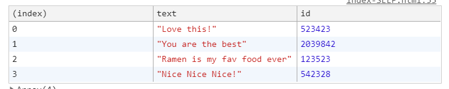
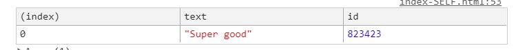

# Javascript30 - Day

>  Array Cardio Day 2


## some()

> some() 메서드는 배열 안의 어떤 요소라도 주어진 판별 함수를 통과하는지 테스트
>
> true or false 값을 반환

[Javascript MDN some](https://developer.mozilla.org/en-US/docs/Web/JavaScript/Reference/Global_Objects/Array/some)

- callback함수를 수행해서 배열의 요소 중 하나라도 참이라면 true, 그렇지 않다면 false
- 값이 존재하는지 확인하는데 사용 할 수 있다.

```Javascript
// 사용
 const isAdult = people.some(function(person){
     const currentYear = (new Date()).getFullYear();
     if (currentYear - person.year >= 19) {
         return true;
     }
 })
 
 //arrow function을 사용
 const isAdult = people.some(person => ((new Date()).getFullYear()) - person.year >= 19);
```


## every()

> every() 메서드는 배열 안의 모든 요소가 주어진 판별 함수를 통과하는지 테스트

[Javascript MDN every](https://developer.mozilla.org/en-US/docs/Web/JavaScript/Reference/Global_Objects/Array/every)

- callback함수를 수행해서 배열의 요소가 모두 참이라면 true, 그렇지 않다면 false

```Javascript
// 사용
 const allAdults = people.every(function(person){
     const currentYear = (new Date()).getFullYear();
     if (currentYear - person.year >= 19) {
         return true;
     }
 })
//arrow function을 사용
const allAdults = people.every(person => ((new Date()).getFullYear()) - person.year >= 19);
```


## find()

>find() 메서드는 주어진 판별 함수를 만족하는 **첫 번째 요소**의 **값**을 반환
>
>그런 요소가 없다면 **undefined**를 반환


```javascript
//사용
const comment = comments.find(function (comment) {
    if (comment.id === 823423) {
        return true
    }
})

//arrow function을 사용
const comment = comments.find(comment => comment.id === 823423);
```


[Javascript MDN find](https://developer.mozilla.org/en-US/docs/Web/JavaScript/Reference/Global_Objects/Array/find)


## findIndex()

> findIndex()메서드는 주어진 판별 함수를 만족하는 배열의 첫 번째 요소에 대한 **인덱스**를 반환. 
>
> 만족하는 요소가 없으면 -1을 반환.

[Javascript MDN findIndex](https://developer.mozilla.org/ko/docs/Web/JavaScript/Reference/Global_Objects/Array/findIndex)

```javascript
//arrow function을 사용
const commentIndex = comments.findIndex(comment => comment.id ===823423)
```


## splice()

>splice() 메서드는 배열의 기존 요소를 **삭제** 또는 **교체**하거나 **새 요소를 추가**하여 배열의 내용을 변경

[Javascript MDN splice](https://developer.mozilla.org/en-US/docs/Web/JavaScript/Reference/Global_Objects/Array/splice)

### 구문

```Javascript
array.splice(start[, deleteCount[, item1[, item2[, ...]]]])
```

- start : 배열의 변경을 시작할 인덱스

- deleteCount : 배열에서 제거할 요소의 수
- item1, item2, ...: 배열에 추가할 요소, 생략할 경우 splice()는 제거만 한다.


```
comments.splice(index, 1)
console.log(comments)
```




splice를 새로운 변수에 입력받아 출력하면 splice로 제거한 것이 출력된다. 

```
const newComments = comments.splice(commentIndex, 1)
console.log(newComments)
```



