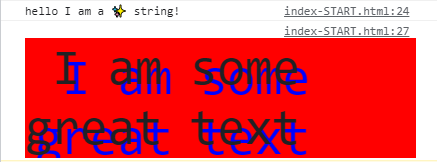
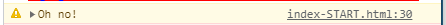
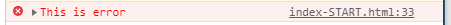
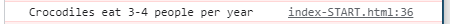
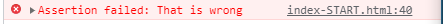
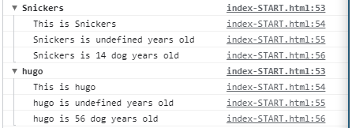
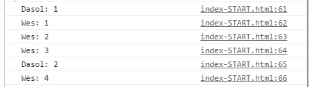
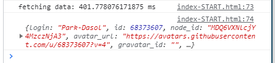
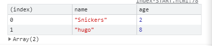

# Javascript30 - Day09

> 14 Must Know Dev Tools Tricks


## log()

```javascript
// 문자열 출력
console.log('hello I am a %s string!', '✨')
//스타일 적용
console.log('%c I am some great text', 'font-size: 50px; background:red; text-shadow :  10px 10px 0 blue;')
```




## warn()

```javascript
 console.warn('Oh no!')
```



## error()

```javascript
 console.error('This is error')
```



## info()

```javascript
 console.info('Crocodiles eat 3-4 people per year')		
```




## assert()

```javascript
const  p = document.querySelector('p')
console.assert(p.classList.contains('ouch'), 'That is wrong')
```




## clear()

> console을 비운다.

## group()

> console.group() 메소드는 웹 콘솔 로그에서 새로운 인라인 그룹을 만든다. 
>
> 그룹별로 새로운 단계의 콘솔메시지가 console.groupEnd()가 불릴때까지 들여쓰기 된다.

```javascript
dogs.forEach(dog => {
    console.group(`${dog.name}`)
    console.log(`This is ${dog.name}`)
    console.log(`${dog.name} is ${dog.ajge} years old`)
    console.log(`${dog.name} is ${dog.age*7} dog years old`)
    console.groupEnd(`${dog.name}`)
})
```



## count()

> console.count() 메서드는 특정 count()호출의 횟수를 세어 출력

```javascript
  console.count('Dasol')
  console.count('Wes')
  console.count('Wes')
  console.count('Wes')
  console.count('Dasol')
  console.count('Wes')
```




## time()

> 타이머를 시작해 작업이 얼마나 걸리는지 추적
>
> 같은 이름으로 [`console.timeEnd()`](https://developer.mozilla.org/ko/docs/Web/API/Console/timeEnd)를 호출할 때, 브라우저가 밀리초 단위로 경과한 시간을 출력

```javascript
console.time('fetching data')
fetch('https://api.github.com/users/Park-Dasol')
    .then(data=> data.json())
    .then(data => {
    console.timeEnd('fetching data')
    console.log(data)
})
```



## table()

```javascript
console.table(dogs)
```



